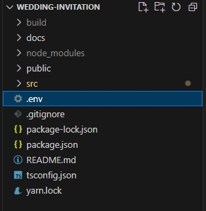

### **`환경변수 값 입력 설명서`**

해당 프로젝트에서는 보안을 위해 .env 파일을 생성하여 환경변수로 관리를 하고 있습니다.
package.json의 파일 경로와 동일한 위치로 .env 파일을 생성해주세요
.env의 변수 값은 아래와 같으며 생성한 .env파일에 아래 내용을 복사하여 값을 입력하는 방법으로 사용해주세요.



### `.env 파일 설정 안내`

```ini
# Open API
REACT_APP_SK_API_KEY=           # TMAP javascript API (현재 개발 없음)
REACT_APP_KAKAO_API_KEY=        # Kakao javascript api key (kakao developer에서 app 생성 후 발급 필요)
REACT_APP_API_BASE_URL=         # github io url

# 신랑 개인 정보
REACT_APP_GROOM_LAST_NAME=  # 신랑 성
REACT_APP_GROOM_FIRST_NAME= # 신랑 이름
REACT_APP_GROOM_BRITH_ORDER=    # 신랑 태어난 순서 예) 장남, 차남
REACT_APP_GROOM_BANK_NAME=  # 신랑 은행이름
REACT_APP_GROOM_BANK_ACCOUNT_NUMBER=    # 신랑 은행 계좌번호
REACT_APP_GROOM_KAKAO_PAY_AVAILABLE=    # 신랑 카카오페이 사용: true, 미사용: false

# 신랑 아버지 정보
REACT_APP_GROOM_FATHER_NAME=    # 신랑 아버지 성
REACT_APP_GROOM_FATHER_BANK_NAME=   # 신랑 아버지 은행이름
REACT_APP_GROOM_FATHER_BANK_ACCOUNT_NUMBER= # 신랑 아버지 은행 계좌번호
REACT_APP_GROOM_FATHER_KAKAO_PAY_AVAILABLE= # 신랑 아버지 카카오페이 사용: true, 미사용: false

# 신랑 어머니 정보
REACT_APP_GROOM_MOTHER_NAME=    # 신랑 어머니 성
REACT_APP_GROOM_MOTHER_BANK_NAME=   # 신랑 어머니 은행이름
REACT_APP_GROOM_MOTHER_BANK_ACCOUNT_NUMBER= # 신랑 어머니 은행 계좌번호
REACT_APP_GROOM_MOTHER_KAKAO_PAY_AVAILABLE= # 신랑 어머니 카카오페이 사용: true, 미사용: false

# 신부 개인 정보
REACT_APP_BRIDE_LAST_NAME=  # 신부 성
REACT_APP_BRIDE_FIRST_NAME= # 신부 이름
REACT_APP_BRIDE_BRITH_ORDER=    # 신부 태어난 순서 예) 장남, 차남
REACT_APP_BRIDE_BANK_NAME=  # 신부 은행이름
REACT_APP_BRIDE_BANK_ACCOUNT_NUMBER=    # 신부 은행 계좌번호
REACT_APP_BRIDE_KAKAO_PAY_AVAILABLE=    # 신부 카카오페이 사용: true, 미사용: false

# 신부 아버지 정보
REACT_APP_BRIDE_FATHER_NAME=    # 신부 아버지 성
REACT_APP_BRIDE_FATHER_BANK_NAME=   # 신부 아버지 은행이름
REACT_APP_BRIDE_FATHER_BANK_ACCOUNT_NUMBER= # 신부 아버지 은행 계좌번호
REACT_APP_BRIDE_FATHER_KAKAO_PAY_AVAILABLE= # 신부 아버지 카카오페이 사용: true, 미사용: false

# 신부 어머니 정보
REACT_APP_BRIDE_MOTHER_NAME=    # 신부 어머니 성
REACT_APP_BRIDE_MOTHER_BANK_NAME=   # 신부 어머니 은행이름
REACT_APP_BRIDE_MOTHER_BANK_ACCOUNT_NUMBER= # 신부 어머니 은행 계좌번호
REACT_APP_BRIDE_MOTHER_KAKAO_PAY_AVAILABLE= # 신부 어머니 카카오페이 사용: true, 미사용: false
```

